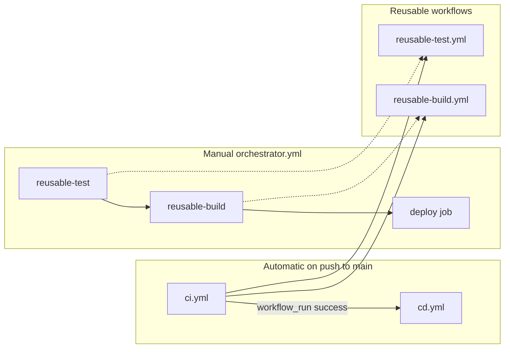

# CICD — GitHub Actions orchestration demo

Small Python app plus several workflows that show how to split CI/CD by purpose and wire them together.

## Project layout

```
src/cicd_demo/          # Application code
tests/                  # Pytest suite
.github/workflows/
  ci.yml                # Lint → test → build (push / PR)
  cd.yml                # Deploy after CI succeeds on main
  orchestrator.yml      # Manual full pipeline (workflow_dispatch)
  reusable-test.yml     # Callable: lint + pytest
  reusable-build.yml    # Callable: package + upload artifact
  demo.yml              # Quick smoke test
```

## Workflows and purpose

| File | Trigger | Role |
|------|---------|------|
| `ci.yml` | Push / PR to `main` | **Integration** — lint, then call reusable test, then reusable build |
| `cd.yml` | After `CI` completes on `main` | **Delivery** — deploy only if CI succeeded (`workflow_run`) |
| `orchestrator.yml` | Manual (Actions tab) | **Orchestration** — chains reusable workflows + deploy job with `needs` |
| `reusable-test.yml` | `workflow_call` only | Shared test + lint job |
| `reusable-build.yml` | `workflow_call` only | Shared zip artifact build |
| `demo.yml` | Push to `main` or manual | Fast hello-world smoke |

## Orchestration flow



**Patterns used**

1. **`needs`** — Jobs run in order within one workflow (`ci.yml`: lint → test → build).
2. **`workflow_call`** — `ci.yml` and `orchestrator.yml` call shared logic in `reusable-*.yml`.
3. **`workflow_run`** — `cd.yml` starts only after the `CI` workflow finishes on `main`.
4. **`workflow_dispatch`** — Run `orchestrator.yml` or `demo.yml` from the Actions UI with inputs.

## Run locally

```bash
pip install -r requirements.txt
ruff check src tests
pytest -v
```

Set `PYTHONPATH=src` if you run modules directly:

```bash
PYTHONPATH=src python -c "from cicd_demo.greeting import greet; print(greet('local'))"
```

## Try on GitHub

1. Push to `main` — **CI** runs, then **CD** if CI passes.
2. Open **Actions → Orchestrator → Run workflow** — pick `staging` or `production`, optionally skip deploy.
3. Open **Actions → Demo** — quick smoke without the full chain.

> **Note:** `cd.yml` and `orchestrator.yml` use GitHub `environment` names (`production`, `staging`). Create them under **Settings → Environments** if you want protection rules; otherwise they work as labels only.
